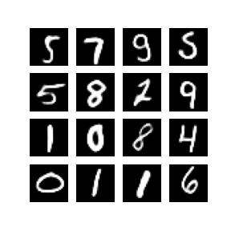
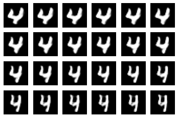
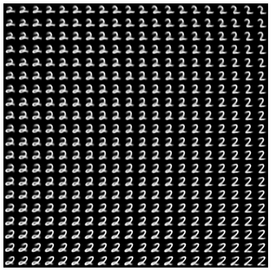

# tensorflow_v2_cvae_sample

Sample implementation of Conditional Variational Autoencoder (CVAE).

<table>
  <tr>
    <td>sample-cvae-mnist.ipynb</td>
    <td>
        
    </td>
    <td>
        <a target="_blank" href="https://github.com/kn1cht/tensorflow_v2_cvae_sample/blob/master/sample-cvae-mnist.ipynb">
        
        GitHub</a>
    </td>
  </tr>
  <tr>
    <td>sample-cvae-mnist-manifold.ipynb</td>
    <td>
        
    </td>
    <td>
        <a target="_blank" href="https://github.com/kn1cht/tensorflow_v2_cvae_sample/blob/master/sample-cvae-mnist-manifold.ipynb">
        
        GitHub</a>
    </td>
  </tr>
</table>

This code includes sample implementation from [TensorFlow Core Tutrial](https://github.com/tensorflow/docs/blob/master/site/en/tutorials/generative/cvae.ipynb).

- Copyright 2020 The TensorFlow Authors. All rights reserved.
- distributed in the Apache License 2.0 (https://github.com/tensorflow/docs/blob/master/LICENSE)
- contributed by @lamberta @MarkDaoust @yashk2810
- changed by @kn1cht (June 15, 2020)

## Result
- After 100 epochs

- Continuously change writing style

- 2D manifold of the latent space

